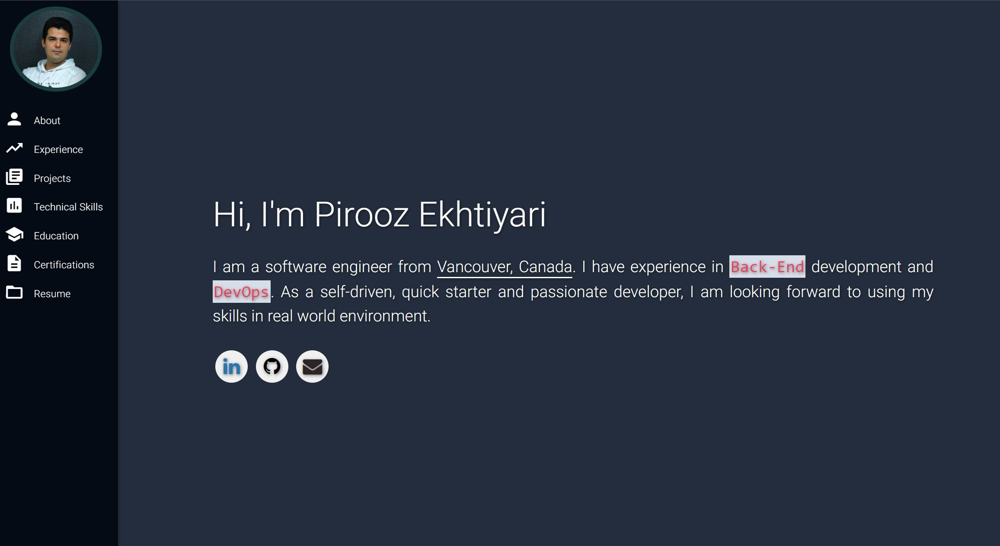

# Personal Portfolio/Resume Website
A personal portfolio/resume website, hosted on GitHub Pages. Built using HTML5 and CSS3. Simple, clean, easy to modify, and responsive. **[Live Demo](https://vyngard.github.io)**.  

This website is a modified version of https://varadbhogayata.github.io/


### Website Preview
---
<p align="center"> 
  <kbd>
    <a href="https://vyngard.github.io" target="_blank">
  </a>
  </kbd>
</p>

## Table of Contents

- [Sharing And Contributing](#sharing-and-contributing)
- [Prerequisites](#prerequisites)
- [Features](#features)
- [Setup And Deployment](#setup-and-deployment)
- [Sections](#sections)
- [Tools](#tools)
- [License](#license)

## Sharing And Contributing
This project is open source. Pull requests are welcome. Feel free to make your own version. Add your own resume, links, and images. **Mark star ⭐ if you like the project, it will help a lot.**

## Prerequisites
Just a GitHub account and an editor ! You don't need anything else.

## Features
- Dark Mode
- Fully Responsive
- Valid HTML5 & CSS3
- Easy to modify

## Setup And Deployment
1. Fork this repository to your GitHub account.
2. Clone the forked repo from your account using:

   ```bash
     git clone https://github.com/<your-username>/home.git
   ```
>⚠️  If you clone directly without forking, remember to use the correct name, or it won't work on your GitHub page. [Here](https://docs.github.com/en/pages/quickstart) is a quickstart for creating a GitHub Page.
3. Edit [index.html](./index.html) and [style.css](./assets/css/style.css) files
4. Add your own images in [./assets/img/](./assets/img/)
5. Add your own resume in [./assets/resume/](./assets/resume/)
6. Push the final project to the `main` branch of the repo
7. Congrats. Your website is up and running. to see it live, visit

   ```https
     https://<your-username>.github.io/home
   ```
>⚠️  It takes a couple of minutes that your website shows up

## Sections
- About me
- Experience
- Projects 
- Technical Skills 
- Education
- Certifications
- Resume

## Tools
- [<b>GitHub Pages</b>](https://create-react-app.dev/docs/deployment/#github-pages) - To host my static website (HTML, CSS, JS).
- [<b>Materialize</b>](https://materializecss.com/) - A CSS framework to get Google's Material Design components.


## License
This project is licensed under the MIT License - see the [LICENSE.md](./LICENSE) file for details.
